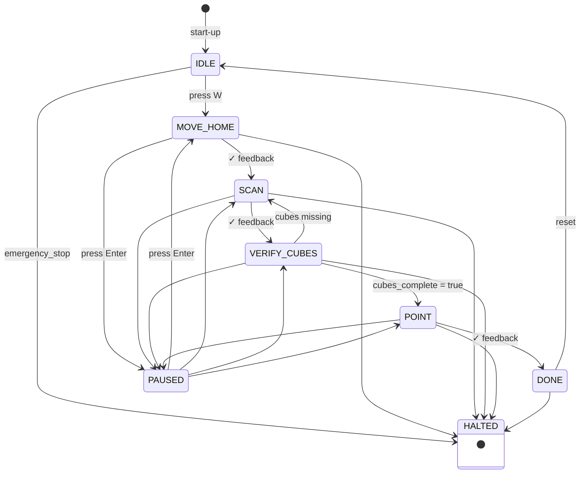

# **process_handler**

`process_handler` is a state machine that controls the robot’s task sequence.  
Pressing **W** starts the process:

1. Move to home  
2. Scan the environment  
3. Verify cubes  
4. Point at cubes  
5. Finish

The system stops immediately if an emergency stop (**Space**) is triggered.  
Pressing **Enter** pauses or resumes the sequence.

---

### State Descriptions

- `IDLE`: Waiting for 'W' to start.
- `MOVE_HOME`: Sends robot to home position.
- `SCAN`: Starts scanning for cubes.
- `VERIFY_CUBES`: Waits for scene data to confirm cube location.
- `POINT`: Commands robot to point at each identified cube.
- `DONE`: Sequence complete, ready to restart.
- `HALTED`: Emergency stop triggered.
- `PAUSED`: Temporarily halted by user (Enter).

---

### Build & Run Instructions

```bash
colcon build --packages-select process_handler
source install/setup.bash
```

```bash
ros2 run process_handler process_handler
```

---

### Flow Chart



### Interfaces

| Direction | Name | Type | Purpose |
|-----------|------|------|---------|
| **Publishes** | `/task_command` | `process_msgs/Task` | Sends MOVE_HOME, SCAN, POINT tasks |
| **Subscribes** | `/task/feedback` | `process_msgs/TaskFeedback` | Detect task success/failure |
| 〃 | `/scene/state` | `process_msgs/SceneState` | Checks if all cubes found |
| 〃 | `/active_keys` | `process_msgs/KeyEvent` | Start (W) and emergency-stop flag |
| **Service** | `GetScene` | `process_msgs/srv/GetScene` | Snapshot of latest `SceneState` |

---

### Troubleshooting

| Symptom | Remedy |
|--------|--------|
| `ModuleNotFoundError: process_msgs` | Run `colcon build --packages-select process_handler`, then `source install/setup.bash` |
| Pressing **W** does nothing | Verify `input_handler` publishes to `/active_keys` |
| Process Handler loops on **SCAN** | Vision isn’t setting `cubes_complete=true`; inspect `/scene/state` |
| Transitions never occur | `robot_controller` may not be publishing success feedback |

---