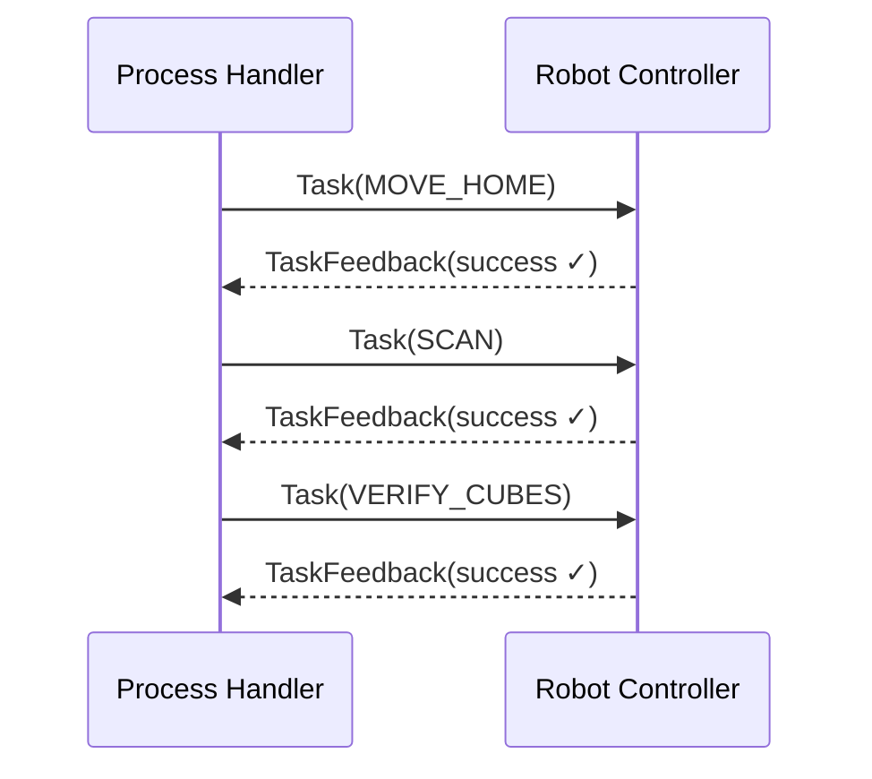

# **robot_controller**

`robot_controller` turns **Task** messages coming from the `process_handler` into real motion using MoveIt.  
It understands three commands and reports the result of each one:

| Command | Action |
|---------|--------|
| `MOVE_HOME`   | Drive joints to the predefined “home” pose |
| `SCAN`        | Sweep a half‑circle above the work area so the camera sees the whole table |
| `VERIFY_CUBES`| Point the gripper above every cube published by vision for quick visual confirmation |

If planning or execution fails, the node sends a negative `TaskFeedback` so the state machine can react.

---

### Functionality

- **Home move** – plans a straight‑line joint motion to the `home_joints` vector (editable in code).  
- **Workplace scan** – starting at `scan_angle_start`, steps through `num_scan_points` poses around a radius `scan_radius` at height `scan_height`, first CCW, then CW, then returns home.  
- **Cube pointing** – listens to `/cubes/virtual_boxes`; for each cube (`red`, `yellow`, `blue`, `green`) it rises to `scan_height`, slews over **x/y**, then descends to `camera_height + cube_point_offset`.  

---

### Interfaces

| Direction      | Topic / Service        | Type                               | Purpose                                    |
|----------------|------------------------|------------------------------------|--------------------------------------------|
| **Subscribes** | `/task_command`        | `process_msgs/Task`                | Tasks from **Process Handler**  |
| 〃             | `/cubes/virtual_boxes` | `process_msgs/CubeArray`           | Latest cube coordinates from vision        |
| 〃             | `/scene/state`         | `process_msgs/SceneState`          | Overall scene (optional)                   |
| **Publishes**  | `/task/feedback`       | `process_msgs/TaskFeedback`        | Success / failure for each command         |
| 〃             | `/joint_states`¹       | `sensor_msgs/JointState`           | Mirror of current joint angles (optional)  |

*Published only if `publishJointStates()` timer is enabled.*

---

### Key Parameters

| Name | Default | Meaning |
|------|---------|---------|
| `planning_pipeline_id` | `pilz_industrial_motion_planner` | MoveIt planning pipeline |
| `planner_id`           | `PTP`                            | Planner inside pipeline  |
| `planning_group`       | `ur_manipulator`                | MoveIt group name        |
| `scan_radius`          | `0.4` m                           | Distance from table centre during scan |
| `scan_height`          | `0.4` m                           | Z height for scan poses  |
| `num_scan_points`      | `8`                               | Waypoints on each half‑circle |
| `scan_angle_start`     | `0.0` rad                         | First scan angle         |
| `scan_angle_end`       | `3.1415` rad                      | Last scan angle          |
| `cube_point_offset`    | `0.1` m                           | Extra Z‑offset when pointing |
| `camera_{height,width,length}` | `0.04` m each            | Collision box dimensions |
| `camera_offset`        | `0.01` m                          | Offset of camera along tool frame Z |
| `camera_offset_width`  | `0.0` m                           | Offset along tool frame Y |

All parameters are declared **dynamic**; use  
`ros2 param set /robot_controller_node <param> <value>` to tweak while the node is running.

---

### Build & Run

```bash
colcon build --packages-select robot_controller
source install/setup.bash
```

```bash
ros2 run robot_controller robot_controller_node
```

Or via the provided launch file (loads `config/parameters.yaml` automatically):

```bash
ros2 launch robot_controller robot_controller.launch.py
```

---

### Sequence Overview



---

### Troubleshooting

| Symptom | Remedy |
|---------|--------|
| *Terminal shows “Plan failed”* | Increase `scan_height` or remove obstacles from the planning scene. |
| *Node never leaves **SCAN*** | Make sure `num_scan_points > 0` and Process Handler actually sent `SCAN`. |
| *Some cubes are skipped* | Verify `/cubes/virtual_boxes` publishes correct `color` strings (`red`, `yellow`, `blue`, `green`). |
| *Collision object absent in RViz* | Toggle “Attached Collision Objects” display or nudge a camera parameter to trigger an update. |
| `ModuleNotFoundError: process_msgs` | Re‑run `colcon build --packages-select robot_controller` then re‑source `install/setup.bash`. |

---
