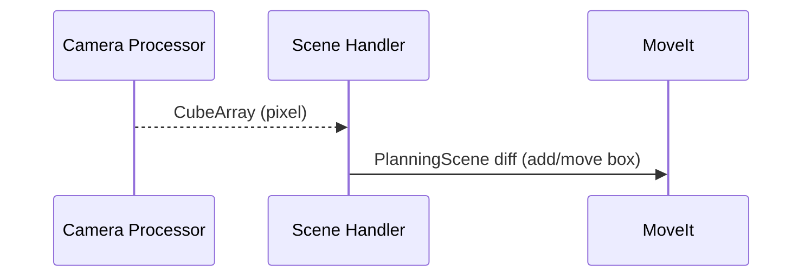

# **scene_handler**

`scene_handler` connects perception and planning, it converts pixel–space cube detections into **world‑frame boxes** and manages the MoveIt planning scene.

---

### Functionality

1. **Camera → Base transform**  
   * `matrix_transformations` undistorts raw pixel coordinates and projects them through calibrated **intrinsics** and a DH transform of the wrist‑mounted camera to get a 3‑D point in the robot base frame.  
2. **Virtual boxes**  
   * Maintains four `Box` objects (red, blue, green, yellow).  
   * Each update is low‑pass filtered (`camera_filter_position_filter_strenght`) to reject jitter.  
   * Adds or moves a `moveit_msgs/CollisionObject` of the same colour and size in the planning scene.  
3. **Safe‑zone geometry**  
   * Inserts the robot base plate and working table as static collision objects once at startup.  
4. **Task gating**  
   * `/task_command` with `SCAN` toggles **allow_cube_updates** so the vision layer only mutates the scene when requested.  
5. **Periodic publishing**  
   * Every 200 ms publishes `/cubes/virtual_boxes` (`CubeArray`) holding the *filtered* cube positions and yaws.

---

### Interfaces

| Direction   | Topic               | Type                          | Purpose                                    |
|-------------|---------------------|------------------------------|--------------------------------------------|
| **Subscribes** | `/joint_states`        | `sensor_msgs/JointState`         | Tool pose for TF‑based camera extrusion    |
| 〃             | `/cubes/detections`    | `process_msgs/CubeArray`         | Raw pixel detections from **camera_processor** |
| 〃             | `/task_command`        | `process_msgs/Task`              | Enable/disable cube updates (`SCAN`)       |
| **Publishes**  | `/planning_scene`      | `moveit_msgs/PlanningScene`      | Diff updates with coloured boxes           |
| 〃             | `/cubes/virtual_boxes` | `process_msgs/CubeArray`         | Filtered, base‑frame cube poses            |

---

### Key Parameters

| Name | Default | Explanation |
|------|---------|-------------|
| `box_size_x` / `box_size_y` / `box_size_z` | `0.05 m` | Collision box dimensions for cubes |
| `camera_x_offset` / `camera_y_offset`      | `‑0.025` / `0.12 m` | Pixel‑to‑camera translation hacks (fine‑tune calibration) |
| `camera_filter_position_filter_strenght`   | `0.9`   | α for exponential smoothing of cube positions (0 = no filter, 1 = frozen) |

All parameters are **dynamic** – tweak on the fly:

```bash
ros2 param set /scene_handler_node box_size_x 0.06
```

---

### Build & Run

```bash
# Build only scene_handler
colcon build --packages-select scene_handler
source install/setup.bash
```

```bash
ros2 run scene_handler scene_handler_node
```

Or with its launch file (loads `config/parameters.yaml`):

```bash
ros2 launch scene_handler scene_handler.launch.py
```

---

### Sequence Chart



---

### Troubleshooting

| Symptom | Remedy |
|---------|--------|
| Boxes appear shifted | Adjust `camera_x_offset` / `camera_y_offset`, verify camera intrinsics. |
| No collision objects show up | Confirm `/planning_scene` is being published and RViz “Planning Scene” display is enabled. |
| Updates stop after scan | `/task_command` must carry `SCAN` again to re‑enable updates. |
| “Could not transform base_link → tool0” | Check TF tree and increase TF lookup timeout. |
| Collision boxes jitter | Reduce `camera_filter_position_filter_strenght` (e.g. 0.6). |

---